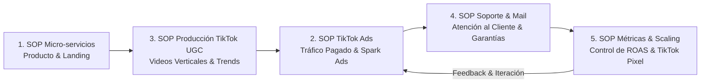

# Mapa de Procesos Esenciales de Operación: Quant Partners (Q-LT)

Este documento define la arquitectura mínima viable de 5 SOPs operativos para ejecutar y escalar el negocio de infoproductos y micro-servicios mediante **TikTok Ads**.

---

## 🗺️ Matriz de los 5 SOPs Esenciales

---

### 📌 Lista Máster de Procesos:

| Código | SOP | Estado | Propósito Operativo |
| :--- | :--- | :--- | :--- |
| **SOP-QP-001** | **Creación y Despliegue de Micro-Servicios** | ✅ **COMPLETADO** | Clonar y desplegar landings de alta conversión (S/29, Bump S/10, Upsell S/67, Downsell S/37). |
| **SOP-QP-002** | **Creación y Lanzamiento de TikTok Ads** | ⏳ *PENDIENTE* | Configuración de TikTok Ads Manager, estructuras de campaña (Spark Ads & Custom Identity) y segmentación. |
| **SOP-QP-003** | **Producción de Creativos Verticales TikTok (UGC)** | ⏳ *PENDIENTE* | Scripts de enganche (Hooks 3 segs), edición ágil en CapCut/TikTok, audios en tendencia y pruebas UGC. |
| **SOP-QP-004** | **Atención al Cliente y Soporte por Correo Corporativo** | ⏳ *PENDIENTE* | Respuestas rápidas para entregas de accesos, soporte post-compra y gestión de garantías/devoluciones. |
| **SOP-QP-005** | **Control de Métricas y Optimización del Embudo** | ⏳ *PENDIENTE* | Hoja de control diario/semanal: CPA en TikTok Ads, ROAS, Conversión % y reglas de escalamiento. |

---

## 🎯 Por qué esta lista de 5 es la exacta y suficiente:
1. **Producto (001):** Ya está resuelto y estandarizado.
2. **Creativos TikTok (003):** La materia prima esencial para que los anuncios de TikTok no parezcan anuncios.
3. **Tráfico Pagado (002):** El motor TikTok Ads para inyectar prospectos masivos a la landing.
4. **Atención & Garantía (004):** Mantiene la reputación y procesa post-venta por correo.
5. **Métricas & Control (005):** El "tablero de control" para medir el rendimiento de TikTok Ads y rentabilidad.
