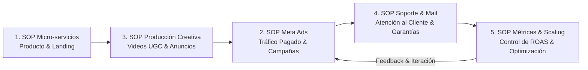

# Mapa de Procesos Esenciales de Operación: Quant Partners (Q-LT)

Este documento define la arquitectura mínima viable de 5 SOPs operativos para ejecutar y escalar el negocio de infoproductos y micro-servicios.

---

## 🗺️ Matriz de los 5 SOPs Esenciales

---

### 📌 Lista Máster de Procesos:

| Código | SOP | Estado | Propósito Operativo |
| :--- | :--- | :--- | :--- |
| **SOP-QP-001** | **Creación y Despliegue de Micro-Servicios** | ✅ **COMPLETADO** | Clonar y desplegar landings de alta conversión (S/29, Bump S/10, Upsell S/67, Downsell S/37). |
| **SOP-QP-002** | **Creación y Lanzamiento de Meta Ads** | ⏳ *PENDIENTE* | Configuración de Business Manager, estructura de campañas, copys y segmentación en Perú. |
| **SOP-QP-003** | **Producción de Creativos Verticales (UGC & Prueba Social)** | ⏳ *PENDIENTE* | Scripts de grabación de 15-30s, edición móvil, ángulos de gancho y testimonios para anuncios. |
| **SOP-QP-004** | **Atención al Cliente y Soporte por Correo Corporativo** | ⏳ *PENDIENTE* | Respuestas rápidas para entregas de accesos, soporte post-compra y gestión de garantías/devoluciones. |
| **SOP-QP-005** | **Control de Métricas y Optimización del Embudo** | ⏳ *PENDIENTE* | Hoja de control diario/semanal: CPA, ROAS, Conversión de Landing y decisiones de escalado. |

---

## 🎯 Por qué esta lista de 5 es la exacta y suficiente:
1. **Producto (001):** Ya está resuelto y estandarizado.
2. **Creativos (003):** La materia prima que alimenta las campañas de anuncios.
3. **Tráfico Pagado (002):** El motor para inyectar clientes a la landing diariamente.
4. **Atención & Garantía (004):** Mantiene la reputación en Meta Ads y procesa post-venta.
5. **Métricas & Control (005):** El "tablero de control" que te dice si estás ganando dinero, cuándo escalar y cuándo apagar un anuncio.
